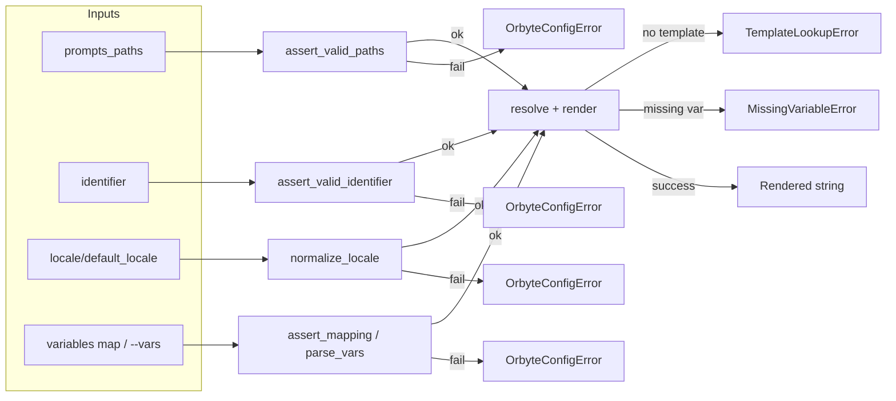
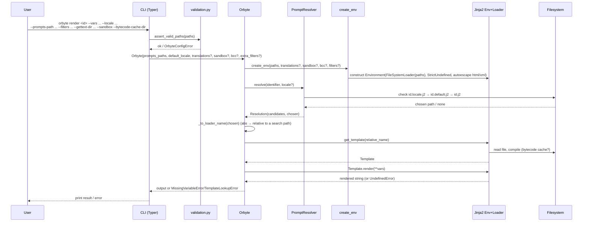

# Developer Guide

Orbyte is a filesystem-first prompt templating library with locale fallback support, built for managing internationalized Jinja2 templates.

## Table of Contents

- [Architecture Overview](#architecture-overview)
- [Core Components](#core-components)
- [Development Setup](#development-setup)
- [Code Organization](#code-organization)
- [Template Resolution Logic](#template-resolution-logic)
- [API Reference](#api-reference)
- [CLI Commands](#cli-commands)
- [Testing](#testing)
- [Contributing](#contributing)
- [Advanced Usage](#advanced-usage)

## Architecture Overview

Orbyte follows a modular architecture with clear separation of concerns:

```
┌─────────────────┐    ┌─────────────────┐    ┌─────────────────┐
│   CLI Layer     │    │   Core Layer    │    │ Template Layer  │
│   (cli.py)      │────│   (core.py)     │────│   (Jinja2)      │
└─────────────────┘    └─────────────────┘    └─────────────────┘
                              │
┌─────────────────┐    ┌─────────────────┐    ┌─────────────────┐
│  Validation     │    │   Resolver      │    │  Environment    │
│ (validation.py) │    │ (resolver.py)   │    │   (env.py)      │
└─────────────────┘    └─────────────────┘    └─────────────────┘
```

### Design Principles

1. **Filesystem-first**: Templates are organized as files with intuitive naming conventions
2. **Locale fallback**: Graceful degradation from specific to general templates
3. **Security**: Built-in protection against path traversal and template injection
4. **Performance**: Bytecode caching and efficient resolution algorithms
5. **Simplicity**: Minimal configuration with sensible defaults

## Core Components

### 1. Orbyte Core (`src/orbyte/core.py`)

The main class that orchestrates template rendering:

```python
class Orbyte:
    def __init__(
        self,
        prompts_paths: Iterable[str],
        default_locale: str = "en",
        *,
        translations=None,
        sandbox: bool = False,
        bytecode_cache_dir: Optional[str] = None,
        extra_filters: Optional[Mapping[str, object]] = None,
    )
```

**Key Methods:**
- `render(identifier, variables, locale)` - Renders a template
- `explain(identifier, locale)` - Shows resolution path for debugging
- `list_identifiers()` - Lists available template identifiers
- `parse_vars(value)` - Parses JSON variables or file references

### 2. Template Resolver (`src/orbyte/resolver.py`)

Implements the template resolution logic:

```python
class PromptResolver:
    def resolve(self, identifier: str, locale: str | None = None) -> Resolution
```

**Resolution Algorithm:**
1. Try `identifier.{locale}.j2`
2. Fall back to `identifier.{default_locale}.j2`
3. Fall back to `identifier.j2`
4. Return None if no match found

### 3. Validation Layer (`src/orbyte/validation.py`)

Provides security and input validation:

- **Identifier validation**: Prevents path traversal, enforces naming rules
- **Locale validation**: Ensures proper locale format (e.g., `en`, `en-US`)
- **Path validation**: Verifies directory existence and accessibility

#### Validation checkpoints (happy path vs. errors)


### 4. CLI Interface (`src/orbyte/cli.py`)

Exposes functionality via command-line interface using Typer.

## Development Setup

### Prerequisites

- Python 3.9+
- uv (recommended) or pip

### Installation

```bash
# Clone the repository
git clone <repository-url>
cd orbyte

# Install dependencies
uv sync

# Install in development mode
uv pip install -e .
```

### Development Tools

The project uses these development tools:

```bash
# Linting
uv run ruff check .
uv run ruff format .

# Type checking
uv run mypy src/

# Testing
uv run pytest
uv run pytest --cov=src/orbyte

# Using nox for multiple environments
uv run nox
```

## Code Organization

```
src/orbyte/
├── __init__.py          # Public API exports
├── cli.py              # Command-line interface
├── core.py             # Main Orbyte class
├── env.py              # Jinja2 environment setup
├── exceptions.py       # Custom exceptions
├── resolver.py         # Template resolution logic
└── validation.py       # Input validation and security

tests/
├── test_cli.py         # CLI integration tests
├── test_cli_filters.py # Filter loading tests
├── test_orbyte.py      # Core functionality tests
├── test_render.py      # Basic rendering tests
├── test_resolver.py    # Resolution logic tests
└── test_validation.py  # Validation tests

examples/
└── prompts/            # Example templates
```

## Template Resolution Logic

### Naming Convention

Templates follow this naming pattern:
```
{identifier}[.{locale}].j2
```

Examples:
- `greeting.j2` - Default template
- `greeting.en.j2` - English version
- `greeting.es.j2` - Spanish version
- `user_onboarding/welcome.en.j2` - Nested template

### Resolution Process

When resolving `greeting` with locale `es`:

1. **Check specific locale**: `greeting.es.j2`
2. **Check default locale**: `greeting.en.j2` (if default is `en`)
3. **Check base template**: `greeting.j2`
4. **Return None**: If no match found

### Multi-path Resolution

When multiple search paths are configured, Orbyte searches in order:

```python
resolver = PromptResolver([
    "/app/templates",      # Priority 1: App-specific templates
    "/shared/templates"    # Priority 2: Shared templates
], default_locale="en")
```

The first matching template wins, allowing for template overrides.

## API Reference

### Core API

```python
from orbyte import Orbyte

# Initialize
ob = Orbyte(
    prompts_paths=["/path/to/templates"],
    default_locale="en"
)

# Render template
output = ob.render(
    identifier="welcome_email",
    variables={"name": "Alice", "product": "Orbyte"},
    locale="es"
)

# Debug resolution
info = ob.explain("welcome_email", locale="es")
print(f"Chosen: {info['chosen']}")
print(f"Candidates: {info['candidates']}")

# List available templates
identifiers = ob.list_identifiers()
```

### Advanced Configuration

```python
# With custom filters
def reverse_filter(text):
    return str(text)[::-1]

ob = Orbyte(
    prompts_paths=["/templates"],
    extra_filters={"reverse": reverse_filter},
    sandbox=True,  # Use sandboxed environment
    bytecode_cache_dir="/tmp/jinja_cache"
)
```

### Exception Handling

```python
from orbyte import Orbyte, TemplateLookupError, MissingVariableError
from orbyte.validation import OrbyteConfigError

try:
    output = ob.render("template", {"var": "value"})
except TemplateLookupError:
    print("Template not found")
except MissingVariableError as e:
    print(f"Missing variable: {e}")
except OrbyteConfigError as e:
    print(f"Configuration error: {e}")
```

## CLI Commands

### render

Render a template with variables:

```bash
# Basic usage
orbyte render greeting --vars '{"name": "World"}'

# With locale
orbyte render greeting --locale es --vars '{"name": "Mundo"}'

# From file
orbyte render greeting --vars @variables.json

# Multiple search paths
orbyte render greeting \
  --prompts-path ./app/templates \
  --prompts-path ./shared/templates \
  --vars '{"name": "Alice"}'
```
#### CLI render sequence (with validation & options)


### list

List available template identifiers:

```bash
orbyte list --prompts-path ./templates
```

### explain

Debug template resolution:

```bash
orbyte explain greeting --locale es --prompts-path ./templates
```

Output:
```json
{
  "identifier": "greeting",
  "locale": "es",
  "candidates": [
    "/templates/greeting.es.j2",
    "/templates/greeting.en.j2", 
    "/templates/greeting.j2"
  ],
  "chosen": "/templates/greeting.j2"
}
```

### Common Options

All commands support these options:

- `--prompts-path` - Search paths (can be repeated)
- `--default-locale` - Fallback locale (default: `en`)
- `--sandbox` - Use sandboxed Jinja2 environment
- `--bytecode-cache-dir` - Cache compiled templates
- `--filters` - Load custom Jinja2 filters from Python file

### Environment Variables

- `ORBYTE_PROMPTS_PATH` - Colon-separated search paths

## Testing

### Running Tests

```bash
# All tests
uv run pytest

# With coverage
uv run pytest --cov=src/orbyte --cov-report=html

# Specific test file
uv run pytest tests/test_core.py

# Specific test
uv run pytest tests/test_core.py::test_render_basic
```

### Test Structure

Tests are organized by component:

- **Unit tests**: Test individual functions and classes in isolation
- **Integration tests**: Test CLI commands and component interaction
- **Edge case tests**: Test error conditions and boundary cases

### Writing Tests

Example test structure:

```python
def test_feature_name(tmp_path: Path):
    # Arrange: Set up test data
    prompts_dir = tmp_path / "prompts"
    prompts_dir.mkdir()
    (prompts_dir / "test.j2").write_text("Hello {{ name }}!")
    
    # Act: Execute the feature
    ob = Orbyte([str(prompts_dir)])
    result = ob.render("test", {"name": "World"})
    
    # Assert: Verify expected behavior
    assert result == "Hello World!"
```

### Test Fixtures

Common fixtures available:

- `tmp_path` - Temporary directory (pytest built-in)
- `tmp_prompts_dir` - Pre-created prompts directory
- `resolver_single_path` - PromptResolver instance
- `resolver_multi_path` - Multi-path resolver setup

## Contributing

### Code Style

The project follows these style guidelines:

- **PEP 8** for Python code style
- **Ruff** for linting and formatting
- **Type hints** for all public interfaces
- **Docstrings** for classes and public methods

### Pull Request Process

1. **Fork** the repository
2. **Create** a feature branch
3. **Write** tests for your changes
4. **Ensure** all tests pass
5. **Run** linting and type checks
6. **Submit** pull request with clear description

### Development Commands

```bash
# Format code
uv run ruff format .

# Check linting
uv run ruff check .

# Type checking
uv run mypy src/

# Run all checks
uv run nox
```

## Advanced Usage

### Custom Filters

Create a filters file:

```python
# filters.py
def currency(value, symbol="$"):
    return f"{symbol}{value:.2f}"

def truncate(value, length=50):
    return value[:length] + "..." if len(value) > length else value

# Option 1: FILTERS dictionary
FILTERS = {
    "currency": currency,
    "truncate": truncate,
}

# Option 2: get_filters() function
def get_filters():
    return {
        "currency": currency,
        "truncate": truncate,
    }
```

Use with CLI:

```bash
orbyte render invoice --filters ./filters.py --vars '{"amount": 123.45}'
```

Use programmatically:

```python
from orbyte import Orbyte
import runpy

# Load filters
filters_ns = runpy.run_path("./filters.py")
custom_filters = filters_ns.get("FILTERS", {})

ob = Orbyte(
    prompts_paths=["./templates"],
    extra_filters=custom_filters
)
```

### Babel Integration

For advanced i18n features:

```bash
# Install Babel
pip install Babel

# Use with gettext
orbyte render welcome \
  --gettext-dir ./locale \
  --locale es \
  --vars '{"name": "Maria"}'
```

### Performance Optimization

```python
# Enable bytecode caching
ob = Orbyte(
    prompts_paths=["./templates"],
    bytecode_cache_dir="/tmp/orbyte_cache"  # Persistent cache
)

# For high-throughput scenarios
import diskcache

cache = diskcache.Cache("/app/cache")
ob = Orbyte(
    prompts_paths=["./templates"],
    bytecode_cache_dir=cache
)
```

### Template Organization Best Practices

```
templates/
├── emails/
│   ├── welcome.en.j2
│   ├── welcome.es.j2
│   └── welcome.j2
├── notifications/
│   ├── alert.en.j2
│   └── alert.j2
└── shared/
    ├── header.j2
    └── footer.j2
```

Access nested templates:

```python
# Note: Current implementation doesn't support path-based identifiers
# Templates in subdirectories are identified by filename only
ob.render("welcome", {"name": "Alice"})  # Finds emails/welcome.j2
```

### Error Handling Patterns

```python
from orbyte import Orbyte, TemplateLookupError
from orbyte.validation import OrbyteConfigError
import logging

def safe_render(identifier, variables, locale=None):
    try:
        return ob.render(identifier, variables, locale=locale)
    except TemplateLookupError:
        logging.warning(f"Template {identifier} not found")
        return f"[Template {identifier} not available]"
    except OrbyteConfigError as e:
        logging.error(f"Configuration error: {e}")
        raise
    except Exception as e:
        logging.error(f"Unexpected error rendering {identifier}: {e}")
        return "[Template error]"
```

---

## Troubleshooting

### Common Issues

**Template not found**
- Check file naming convention: `identifier[.locale].j2`
- Verify search paths with `orbyte list`
- Use `orbyte explain` to debug resolution

**Path errors**
- Ensure template directories exist
- Check permissions on template files
- Avoid relative paths in production

**Variable errors**
- Validate JSON syntax in `--vars`
- Check template variable names match data
- Use `` blocks for literal content

**Locale issues**
- Use proper locale format: `en`, `en-US`, not `english`
- Check default locale configuration
- Verify template naming matches locale codes

For more help, see the issue tracker or examples directory.